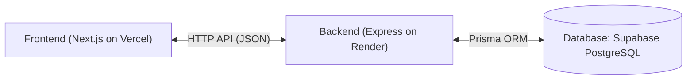

# Phrasal Verb Master 仕様書

> 実装状況は [PROGRESS.md](./PROGRESS.md) を参照。このファイルは仕様のスナップショットであり、実装中に矛盾が見つかった場合はPROGRESS.mdの該当タスクに懸念点を書き残し、判断が必要な場合は人間の確認を待つこと。

## 1.1 プロジェクト概要

- **サービス名（仮）:** Phrasal Verb Master
- **目的:** 英語の句動詞（動詞 + 副詞/前置詞）を効率的に暗記・テストするためのWebアプリケーション。
- **主要ターゲット:** トロント等の英語圏で句動詞をマスターしたい学習者（未ログインでも閲覧可能）。

## 1.2 要件定義

### Functional Requirements（機能要件）

1. **未ログイン向け フラッシュカード（閲覧・学習）機能**
    - 会員登録なしで利用可能。
    - 句動詞カード（1単語目：動詞、2単語目：副詞/前置詞、日本語訳、例文）の閲覧。
    - **日本語訳の表示/非表示切替** トグルボタン。
    - **語句切り替え機能:** カード上の「動詞」または「副詞/前置詞」をクリックすると、その単語とペアになる別の句動詞へ表示が切り替わる（例: `take off` の `off` を押すと `turn off` に遷移、`take` を押すと `take on` に遷移）。
2. **一覧 & 絞り込み機能**
    - 収録されている句動詞の一覧表示。
    - **動詞** によるフィルタリング。
    - **副詞/前置詞** によるフィルタリング。
    - ログインユーザー向け：**学習ステータス（すべて / 覚えた / 覚えてない）** によるフィルタリング。
3. **出題・テスト機能（要ログイン）**
    - **確率的モード遷移（マルコフ鎖モデル）:**
        - **パターンA（動詞固定）:** 指定した動詞（例: `take`）に対して、ペアになる副詞/前置詞を選択（例: `off`, `up`, `on`）。
        - **パターンB（副詞/前置詞固定）:** 指定した副詞/前置詞（例: `off`）に対して、ペアになる動詞を選択（例: `take`, `turn`, `get`）。
        - **モード連続性の重みづけ:** 直前のモードを **70%** の確率で引き継ぎ、**30%** の確率で別のモードへ切り替える（切り替えに粘着性を持たせ、自然な連続出題を実現）。
    - 各問題に対して「覚えた」「覚えてない」の評価ボタンを押下可能。
4. **ユーザー認証・学習状況管理機能**
    - サインアップ / ログイン / ログアウト。
    - ユーザーごとの句動詞ステータス管理（`memorized`: 覚えた / `review_needed`: 覚えてない）。

## 1.3 画面リスト（Screen List）

| 画面ID | 画面名 | 対象ユーザー | 主な機能・UI構成 |
| --- | --- | --- | --- |
| SCR-01 | Top / カード閲覧 | 全員（未ログイン可） | 句動詞カード表示（動詞・副詞/前置詞・訳・例文）、日本語訳の隠す/表示トグル、各単語タップによる別句動詞への切替、ログイン/新規登録への誘導ボタン |
| SCR-02 | 句動詞一覧 | 全員（一部機能限定） | 句動詞グリッド/リスト表示、動詞 / 副詞・前置詞のドロップダウン検索、学習状況フィルター（要ログイン） |
| SCR-03 | クイズ（学習モード） | 要ログイン | 7:3の確率重みづけによる動的モード切替（動詞固定⇄前置詞固定）、選択肢形式のクイズ画面、「覚えた」「覚えてない」即時マークボタン |
| SCR-04 | ログイン / サインアップ | 未ログイン | メールアドレス・パスワード入力フォーム |
| SCR-05 | マイページ / 進捗 | 要ログイン | 全体の学習進捗率（覚えた数 / 全体数）、覚えてない句動詞の再テストショートカット |

## 2. 技術仕様書

### 2.1 技術スタック



- **Frontend:** Next.js (App Router) on Vercel
- **Backend Runtime:** Node.js (v20+) / Express on Render (Free Tier, sleep behavior accepted)
- **Language:** TypeScript
- **Database:** Supabase (PostgreSQL)
- **ORM:** Prisma ORM
- **Data Fetching / State:** SWR
- **Styling:** Tailwind CSS + shadcn/ui
- **API Architecture:** RESTful API

### 2.2 アーキテクチャ設計とディレクトリ構造

**Backend (`phrasal-verb-master-backend`)**

```
src/
├── controllers/       # コントローラー層（HTTPリクエストの受付・制御）
├── services/          # ビジネスロジック層（マルコフ鎖・クイズ状態遷移など）
├── repositories/       # データアクセス層（Prismaを用いたDB操作）
└── types/              # 型定義
```

**Frontend (`phrasal-verb-master-frontend`)**

```
src/
├── app/               # プレゼンテーション層（UI / Next.js Pages）
├── components/        # 共通UIコンポーネント
└── types/             # 型定義
```

### 2.3 インフラストラクチャ・デプロイ構成

- **Frontend ホスティング:** Vercel (Hobby プラン)
- **Backend ホスティング:** Render (Free Tier)
- **データベース:** Supabase (Free Tier)

### 2.4 データベース設計（DB Schema）

#### `phrasal_verbs`

- `id` (UUID / PK)
- `verb` (VARCHAR)
- `particle` (VARCHAR)
- `meaning_ja` (TEXT)
- `example_sentence` (TEXT)

#### `users`

- `id` (UUID / PK)
- `email` (VARCHAR, Unique)
- `password_hash` (VARCHAR)

#### `user_phrasal_verb_statuses`

- `id` (UUID / PK)
- `user_id` (FK -> users.id)
- `phrasal_verb_id` (FK -> phrasal_verbs.id)
- `status` (ENUM: `memorized`, `review_needed`)
- `updated_at` (TIMESTAMP)

### 2.5 API エンドポイントリスト

#### 認証系 (Auth)

- `POST /api/auth/signup` — ユーザー新規登録
- `POST /api/auth/login` — ログイン処理（JWT Cookieを発行）
- `POST /api/auth/logout` — ログアウト処理

#### 句動詞・マスターデータ系 (Phrasal Verbs - パブリックアクセス可)

- `GET /api/verbs` — 句動詞一覧を取得。クエリ: `?verb=take&particle=off&status=review_needed`
- `GET /api/verbs/:id` — 指定した句動詞の詳細を取得
- `GET /api/verbs/related` — カード切り替え用API。クエリ: `?type=verb&value=take`

#### クイズ系 (Quiz)

- `GET /api/quiz/next` — クエリ: `mode: "verb_fixed" | "particle_fixed"`, `word: string`
  - レスポンス例:
    ```json
    {
      "id": "uuid-1",
      "verb": "take",
      "particle": "off",
      "meaningJa": "離陸する、脱ぐ",
      "exampleSentence": "The plane took off."
    }
    ```

#### ユーザー進捗系 (User Progress - 要認証)

- `POST /api/progress/mark` — Body: `{ "phrasalVerbId": "uuid", "status": "memorized" }`
- `GET /api/progress/summary` — ユーザーの全体進捗率データを取得
