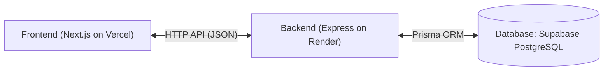

# Phrasal Verb Master 仕様書

> このファイルは実装状況を反映して随時（たまに）更新する。詳細な実装履歴・PRリンクは [PROGRESS.md](./PROGRESS.md) を参照。
> 最終更新: 2026-09-15 — SCR-03（クイズ）をSCR-01（Top）に統合し、独立した`/quiz`画面を廃止。ログイン中のTopページがそのままクイズ体験（覚えた/覚えてないボタン付き）になる。

## 1.1 プロジェクト概要

- **サービス名（仮）:** Phrasal Verb Master
- **目的:** 英語の句動詞（動詞 + 副詞/前置詞）を効率的に暗記・テストするためのWebアプリケーション。
- **主要ターゲット:** トロント等の英語圏で句動詞をマスターしたい学習者（未ログインでも閲覧可能）。

## 1.2 要件定義

### Functional Requirements（機能要件）

1. **未ログイン向け フラッシュカード（閲覧・学習）機能** — ✅ 実装済み（`/`）
    - 会員登録なしで利用可能。
    - 句動詞カード（1単語目：動詞、2単語目：副詞/前置詞、日本語訳、例文）の閲覧。
    - **日本語訳の表示/非表示切替** トグルボタン。
    - **語句切り替え機能:** カード上の「動詞」または「副詞/前置詞」をクリックすると、**クリックした方の単語が変わり、もう一方は固定される**（例: `take off` の `take` を押すと、`off` は固定のまま動詞だけ変わり `turn off` 等に遷移。`off` を押すと `take` は固定のまま `take up` 等に遷移）。
      > 実装メモ（2026-09-14修正）: 当初の仕様例は逆方向（押した方が固定、もう一方が変わる）だったが、実際の要望に合わせて反転した。
      > 実装メモ（2026-09-15）: 未ログイン時は`/`が体験デモ（進捗記録なし）、ログイン時は`/`がそのままクイズ機能（下記3.）になる。旧`/quiz`画面は廃止。
2. **一覧 & 絞り込み機能** — ✅ 実装済み（`/list`）
    - 収録されている句動詞の一覧表示。
    - **動詞** によるフィルタリング。
    - **副詞/前置詞** によるフィルタリング。
    - ログインユーザー向け：**学習ステータス（すべて / 覚えた / 覚えてない）** によるフィルタリング。
3. **出題・テスト機能（要ログイン）** — ✅ 実装済み（`/`、ログイン時）※実装との差分あり、下記メモ参照
    - **確率的モード遷移（マルコフ鎖モデル）:**
        - **パターンA（動詞固定）:** 指定した動詞（例: `take`）に対して、ペアになる副詞/前置詞を選択（例: `off`, `up`, `on`）。
        - **パターンB（副詞/前置詞固定）:** 指定した副詞/前置詞（例: `off`）に対して、ペアになる動詞を選択（例: `take`, `turn`, `get`）。
        - **モード連続性の重みづけ:** 直前のモードを **70%** の確率で引き継ぎ、**30%** の確率で別のモードへ切り替える（切り替えに粘着性を持たせ、自然な連続出題を実現）。
    - 各問題に対して「覚えた」「覚えてない」の評価ボタンを押下可能。
    - > **実装メモ:** 仕様の「選択肢形式のクイズ画面」ではなく、SCR-01と同じ「VERB/PARTICLEカード表示＋クリックで次へ」形式で実装されている（選択肢から選ぶUIではない）。マルコフ連鎖のロジック自体（70/30の重みづけ）はフロントエンド側（「次へ」ボタン押下時）に実装済み。
4. **ユーザー認証・学習状況管理機能** — ✅ 実装済み
    - サインアップ / ログイン / ログアウト（`/signup`, `/login`, ヘッダーのログアウトボタン）。
    - ユーザーごとの句動詞ステータス管理（`memorized`: 覚えた / `review_needed`: 覚えてない）。

## 1.3 画面リスト（Screen List）

| 画面ID | 画面名 | 実装ルート | 対象ユーザー | 状態 | 主な機能・UI構成 |
| --- | --- | --- | --- | --- | --- |
| SCR-01 | Top / カード閲覧（未ログイン） | `/` | 全員（未ログイン可） | ✅ | 句動詞カード表示、訳の表示/非表示トグル、語句クリックでの切替。ログイン/新規登録誘導は全ページ共通ヘッダーが担う |
| SCR-02 | 句動詞一覧 | `/list` | 全員（一部機能限定） | ✅ | グリッド表示、動詞/副詞・前置詞ドロップダウン、学習状況フィルター（要ログイン）。`?status=`クエリで初期フィルター指定可（マイページからのディープリンク用） |
| SCR-03 | クイズ（学習モード、ログイン時のTop） | `/`（ログイン時） | 要ログイン | ✅（UI形式が差分あり） | マルコフ連鎖によるモード継続、「覚えた/覚えてない」ボタン。選択肢形式ではなくカード形式。旧`/quiz`画面を統合したもの |
| SCR-04 | ログイン / サインアップ | `/login`, `/signup` | 未ログイン | ✅ | メールアドレス・パスワード入力フォーム。サインアップ成功後は自動ログインして`/`へ遷移 |
| SCR-05 | マイページ / 進捗 | `/mypage` | 要ログイン | ✅ | 全体の学習進捗率、覚えた/覚えてない件数、「覚えてない句動詞を確認する」→`/list?status=review_needed`への導線 |

## 2. 技術仕様書

### 2.1 技術スタック



- **Frontend:** Next.js (App Router) on Vercel
- **Backend Runtime:** Node.js (v20+) / Express on Render (Free Tier, sleep behavior accepted)
- **Language:** TypeScript
- **Database:** Supabase (PostgreSQL)
- **ORM:** Prisma ORM
- **Data Fetching / State:** ~~SWR~~ → **未使用。** 素の`fetch`を`src/lib/api.ts`の`apiFetch`ヘルパー（`credentials: 'include'`固定）でラップして使用。ログイン状態は`AuthContext`（React Context）で管理
- **Styling:** ~~Tailwind CSS + shadcn/ui~~ → **Tailwind CSSのみ。** shadcn/uiコンポーネントは未導入
- **API Architecture:** RESTful API

### 2.2 アーキテクチャ設計とディレクトリ構造（実装ベースに更新）

**Backend (`phrasal-verb-master-backend`)**

```
src/
├── controllers/    # HTTPリクエストの受付・レスポンス整形
├── services/       # ビジネスロジック・Prisma呼び出し（repositories層は分離せずここに統合）
├── middleware/      # requireAuth（要認証）, optionalAuth（ログイン時のみ挙動変更）
├── routes/          # ルーティング定義
└── types/           # Express Requestの型拡張など
```

**Frontend (`phrasal-verb-master-frontend`)**

```
src/
├── app/             # ページ（Next.js App Router）
├── components/      # 共通UIコンポーネント（Header等）
├── contexts/        # AuthContext（ログイン状態のグローバル管理）
├── lib/             # apiFetch等の共通ユーティリティ
└── types/           # 型定義
```

### 2.3 インフラストラクチャ・デプロイ構成

- **Frontend ホスティング:** Vercel (Hobby プラン)
- **Backend ホスティング:** Render (Free Tier) — Preview Environments未使用（無料プランのため。動作確認はmainマージ後の本番反映で行う）
- **データベース:** Supabase (Free Tier)
- **CI:** GitHub Actions（両リポジトリとも`build`ジョブが必須ステータスチェック。lint/build通過が前提でauto-merge）

**必須環境変数（Render / backend）:**

| 変数名 | 用途 | 備考 |
| --- | --- | --- |
| `DATABASE_URL` | Supabase接続（pgbouncer経由） | 設定済み |
| `DIRECT_URL` | Supabase直接接続（マイグレーション用） | schema.prismaには未追加（後述の残課題参照） |
| `JWT_SECRET` | JWT署名鍵 | ランダムな長い文字列。未設定だとログイン時に500 |
| `FRONTEND_URL` | CORS許可オリジン | `https://phrasal-verb-master-frontend.vercel.app`。未設定だと本番フロントからの全APIコールがCORSでブロックされる（実際に本番障害が発生した） |

**必須環境変数（Vercel / frontend）:**

| 変数名 | 用途 |
| --- | --- |
| `NEXT_PUBLIC_API_BASE_URL` | バックエンドのURL（`https://phrasal-verb-master-backend.onrender.com`） |

### 2.4 データベース設計（DB Schema）

#### `phrasal_verbs`

- `id` (UUID / PK)
- `verb` (VARCHAR)
- `particle` (VARCHAR)
- `meaning_ja` (TEXT)
- `example_sentence` (TEXT)

#### `users`

- `id` (UUID / PK)
- `email` (VARCHAR, Unique)
- `password_hash` (VARCHAR)

#### `user_phrasal_verb_statuses`

- `id` (UUID / PK)
- `user_id` (FK -> users.id)
- `phrasal_verb_id` (FK -> phrasal_verbs.id)
- `status` (ENUM: `memorized`, `review_needed`)
- `updated_at` (TIMESTAMP)

> **実装上の注意（ハマりどころ）:** PrismaのenumはDBの`@map`値ではなく**キー名**（`MEMORIZED`, `REVIEW_NEEDED`）がJS/TSランタイム値になる。API仕様の文字列（`memorized`, `review_needed`）とenumキー名を直接比較・代入すると常に不一致になるバグを実際に踏んだ。`STATUS_MAP`のような変換テーブルを介すこと（`verbsService.ts`, `progressService.ts`参照）。

### 2.5 API エンドポイントリスト

#### 認証系 (Auth)

- `POST /api/auth/signup` — ユーザー新規登録
- `POST /api/auth/login` — ログイン処理（JWT Cookieを発行、Cookie名: `pvm_token`, HttpOnly）
- `POST /api/auth/logout` — ログアウト処理（Cookieクリア）
- `GET /api/auth/me` — **(仕様書に無く実装時に追加)** ログイン状態確認用。フロントの`AuthContext`が使用。未ログイン/無効トークンは401

#### 句動詞・マスターデータ系 (Phrasal Verbs - パブリックアクセス可)

- `GET /api/verbs` — 句動詞一覧を取得。クエリ: `?verb=take&particle=off&status=review_needed`（`status`はログイン時のみ有効。未ログインなら無視されて全件）
- `GET /api/verbs/:id` — 指定した句動詞の詳細を取得
- `GET /api/verbs/related` — カード切り替え用API。クエリ: `?type=verb&value=take`

#### クイズ系 (Quiz)

- `GET /api/quiz/next` — クエリ: `mode: "verb_fixed" | "particle_fixed"`, `word: string`（省略時は完全ランダム。SCR-01の初回カード取得にも流用している）
  - レスポンス例:
    ```json
    {
      "id": "uuid-1",
      "verb": "take",
      "particle": "off",
      "meaningJa": "離陸する、脱ぐ",
      "exampleSentence": "The plane took off."
    }
    ```

#### ユーザー進捗系 (User Progress - 要認証)

- `POST /api/progress/mark` — Body: `{ "phrasalVerbId": "uuid", "status": "memorized" }`。upsert（既存レコードがあれば更新）
- `GET /api/progress/summary` — レスポンス: `{ "totalCount": number, "memorizedCount": number, "reviewNeededCount": number }`

## 3. 既知の残課題（2026-09-13時点、PROGRESS.mdより転記）

- backendリポジトリに、今回の実装とは無関係な未コミットのstash変更が残っている（`prisma/schema.prisma`へのdirectUrl追加、`create_tables.sql`、`package.json`のseedスクリプト変更）。`git stash list`で確認可能。対応要否は人間の判断待ち。
- ブランチ保護の`strict`（マージ前にmainと同期必須）は両リポジトリでfalseにしてある。並行してPRを進める運用と衝突していたため。
- テストコード・E2Eテストは未整備（動作確認は都度手動のブラウザ操作で実施）。
